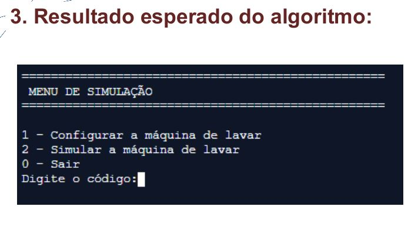
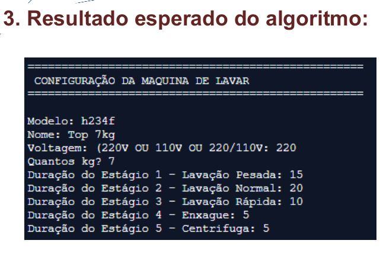
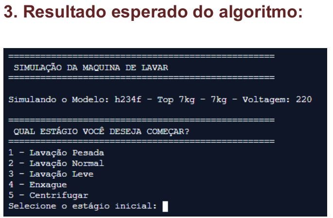
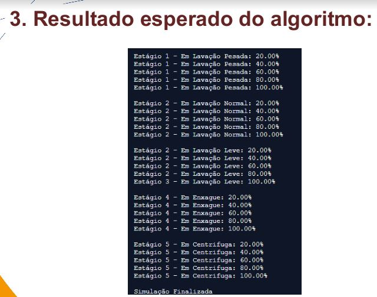

# Desafio Máquina de Lavar

## Contextualização:
A empresa Xilipindum entrará no mercado brasileiro de máquinas de lavar de 5kg,
7kg, 10kg e 15kg.
Você foi acionado(a) para criar um algoritmo que configure a máquina de lavar e
também simule os estágios da máquina.
No futuro, a empresa Xilipindum utilizará seu algoritmo nas futuras máquinas.

## Regras:

<lu>
<li>O sistema deve apresentar um menu de simulação, onde o engenheiro vai
decidir de configura a máquina ou simula os estágios da máquina de lavar;</li>

<li>As máquinas de lavar possuem 5 estágios que são seguidos sequencialmente.
Os estágio são lavação pesada, lavação normal, lavação leve, enxague e
centrífuga.</li>

<li>Os engenheiros preenchem os seguintes dados na configuração da máquina de
lavar: modelo, nome, voltagem, kg, duração dos estágios de lavação pesada,
lavação normal, lavação leve, enxague e centrífuga.</li>

<li>A máquina de lavar utiliza a duração dos estágios cadastrados pelos
engenheiros para executar os 5 estágios.</li>

<li>Durante a execução dos estágios, o seu algoritmo deve calcular o % já
concluído em cada estágio (0% a 100%). Seu algoritmo deve esperar 0,5
segundos para cada atualização do estágio.</li>

<li>O algoritmo deve reproduzir as mesmas saídas de telas nos próximos
slides.</li>

<li>O engenheiro decidirá quando deve finalizar o algoritmo, digitando a
opção 0.</li>
  
<li>O engenheiro poderá configurar a máquina antes da simulação quantas
vezes quiser.</li>

<li>O trabalho é individual e o arquivo deve ser postado no classroom,
conforme a data definida.</li>

  <li>Utilizar o conhecimento aprendido até laços de repetição.</li>
</lu>

## Resultados Esperados do Algoritmo

